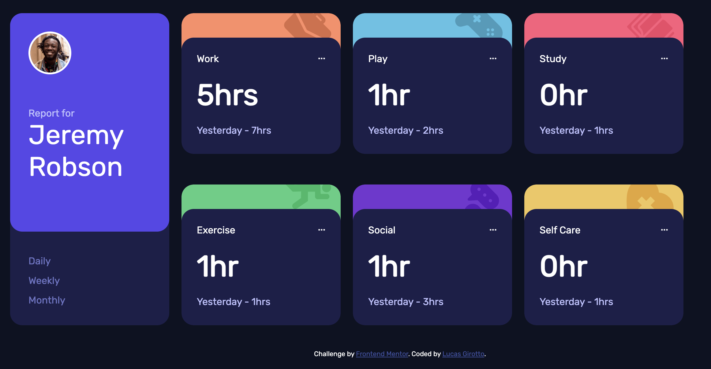
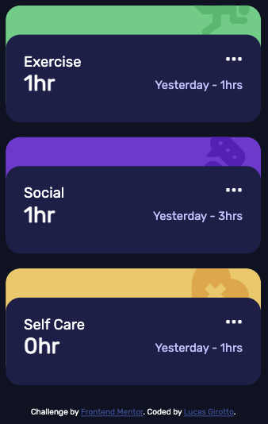

# Frontend Mentor - Time tracking dashboard solution

This is a solution to the [Time tracking dashboard challenge on Frontend Mentor](https://www.frontendmentor.io/challenges/time-tracking-dashboard-UIQ7167Jw). Frontend Mentor challenges help you improve your coding skills by building realistic projects. 

## Table of contents

- [Overview](#overview)
  - [The challenge](#the-challenge)
  - [Screenshot](#screenshot)
  - [Links](#links)
- [My process](#my-process)
  - [Built with](#built-with)
  - [What I learned](#what-i-learned)
  - [Continued development](#continued-development)
  - [Useful resources](#useful-resources)
- [Author](#author)

## Overview

### The challenge

Users should be able to:

- View the optimal layout for the site depending on their device's screen size
- See hover states for all interactive elements on the page
- Switch between viewing Daily, Weekly, and Monthly stats

### Screenshot

Desktop view:



Mobile view:

 


### Links

- Solution URL: https://github.com/Maoaii/Time_Tracking_Dashboard
- Live Site URL: https://maoaii.github.io/Time_Tracking_Dashboard/

## My process

### Built with

- Semantic HTML5 markup
- CSS custom properties
- CSS Grid
- https://fonts.google.com/ (Google fonts)

### What I learned

I learned quite a bit of CSS Grid usage and how easy it is to make a responsive website with it! Check out below the layout for this particular website, simplified of course:

Just a few items with a wrapper that serves as the grid container
```html
<div class="wrapper">
    <div class="tall">
            
    </div>
    <div class="first">

    </div>
    <div class="second">

    </div>
    <div class="third">

    </div>
    <div class="fourth">

    </div>
</div>
```

The CSS styling:
```css
/*
  For the desktop view, there are 4 columns and two rows. Each area is 200px by 200px.
*/
.wrapper {
    display: grid;
    grid-template-columns: repeat(4, 200px);
    grid-template-rows: repeat(2, 200px);
}

/*
  The tall grid item takes up two areas
*/
.tall {
    background-color: red;
    grid-row-start: 1;
    grid-row-end: 3;
}

.first {
    background-color: blue;
}

.second {
    background-color: brown;
}

.third {
    background-color: black;
}

.fourth {
    background-color: yellow;
}

/*
  For screen widths smaller than 500px, we display a one column and 6 rows grid. Areas are the same size.
*/
@media screen and (max-width: 500px) {
    .wrapper {
        display: grid;
        grid-template-columns: repeat(1, 200px);
        grid-template-rows: repeat(6, 200px);
    }

 /*
   Just for a bit of fun, I shortened the tall grid item to half the size of the other squares
 */
    .tall {
        background-color: red;
        height: 100px;
        grid-row-start: 1;
        grid-row-end: 2;
    }

    .first {
        background-color: blue;
    }

    .second {
        background-color: brown;
    }

    .third {
        background-color: black;
    }

    .fourth {
        background-color: yellow;
    } 
}
```

- Desktop view:
  - Now, we can see that in the desktop view, the grid items are layed out side by side, with the exception of the tall one, standing from top to bottom:
- Mobile view:
  - When viewing on mobile, the grid items stack on top of eachother. This is all done by just changing the number of columns and rows with a media query!

</img> </img>

### Continued development

Next thing i'm going to work on is building some functionality on websites with JavaScript. Might come back to this project and add the JS component that I didin't manage to do.

### Useful resources

- https://css-tricks.com/ - This website is a blast for learning CSS styling stuff. I learned almost everything about CSS grid from here. Definitely worth a look.

## Author

- LinkedIn - https://www.linkedin.com/in/lucas-girotto-4530b9233/
- Frontend Mentor - https://www.frontendmentor.io/profile/Maoaii
